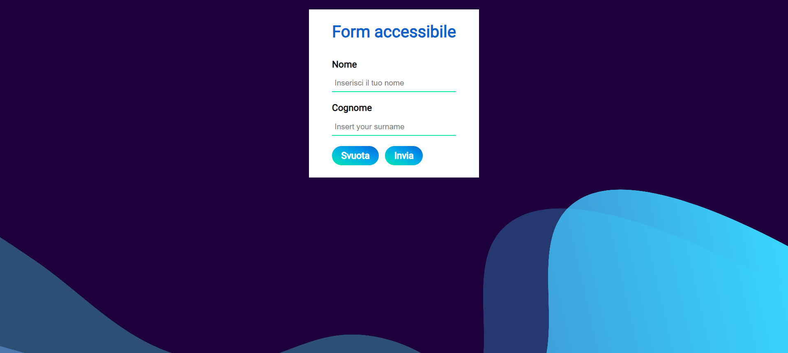

# React + Typescript + styledComponents -> accessible form

## Descrizione

Questo è un piccolo esperimento, per far pratica con l'accessibilità, con gli styled component e con l'utilizzo dell'hook "useReducer" di react; Il tutto accompagnato dalla tipizzazione di TS.

## Status attuale

Al momento è qualcosa di molto semplice, ovviamente si possono aggiungere tanti altri campi, per renderlo anche più realistico.